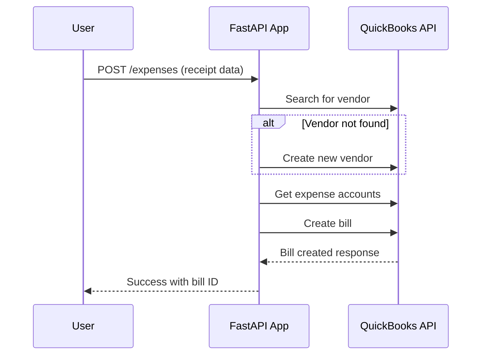
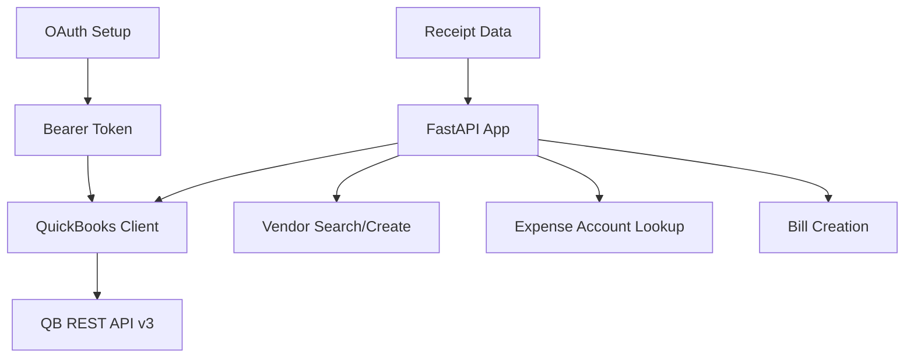
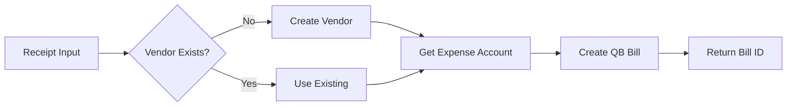

# QuickBooks Receipt Scanner

FastAPI application that converts receipt data into QuickBooks expenses automatically.

## 🎯 What It Does

Transforms receipt information (vendor, amount, date) into QuickBooks bills through REST API endpoints.

## 📋 Prerequisites

- Python 3.12+
- QuickBooks Developer Account
- QuickBooks Sandbox Company

## 🚀 Quick Setup

### 1. Install Dependencies
```bash
pip install -r requirements.txt
```

### 2. Get QuickBooks Credentials
1. Go to [QuickBooks Developer Dashboard](https://developer.intuit.com/app/developer/dashboard)
2. Create/select your app
3. Copy Client ID and Client Secret
4. Add redirect URI: `http://localhost:8000/api/quickbooks/callback`

### 3. Configure OAuth
```bash
# Update oauth_setup.py with your credentials
CLIENT_ID = "your_client_id_here"
CLIENT_SECRET = "your_client_secret_here"

# Run OAuth setup
python oauth_setup.py
```

### 4. Start Application
```bash
python main.py
```

## 🔄 System Flow



## 🏗 Architecture



## 📡 API Endpoints

| Endpoint | Method | Description |
|----------|--------|-------------|
| `/test-connection` | GET | Verify QB connection |
| `/vendors/{name}` | GET | Search vendor by name |
| `/vendors` | POST | Create new vendor |
| `/accounts/expense` | GET | Get expense accounts |
| `/expenses` | POST | Create expense from receipt |

## 📝 Usage Example

```bash
# Test connection
curl http://localhost:8000/test-connection

# Create expense from receipt
curl -X POST http://localhost:8000/expenses \
  -H "Content-Type: application/json" \
  -d '{
    "vendor_name": "Starbucks",
    "amount": 12.50,
    "date": "2024-01-15"
  }'
```

## 🔧 Configuration

Environment variables in `.env`:
- `QB_ACCESS_TOKEN` - OAuth bearer token (1 hour expiry)
- `QB_COMPANY_ID` - QuickBooks company identifier
- `QB_BASE_URL` - Sandbox: `https://sandbox-quickbooks.api.intuit.com`

## 🔄 Token Refresh

Access tokens expire every hour. Re-run `python oauth_setup.py` to get fresh tokens.

## 📊 Data Flow



## 🛠 Troubleshooting

- **"ModuleNotFoundError"**: Run `pip install -r requirements.txt`
- **"401 Unauthorized"**: Token expired, re-run OAuth setup
- **"Connection failed"**: Check QB credentials in `.env`

## 📁 Project Structure

```
├── main.py              # FastAPI application
├── quickbooks_client.py # QB API wrapper
├── models.py           # Data models
├── config.py           # Configuration
├── oauth_setup.py      # OAuth helper
└── requirements.txt    # Dependencies
```